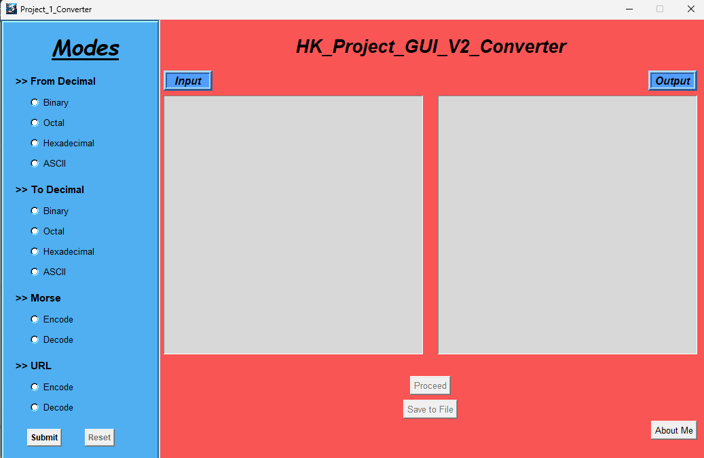
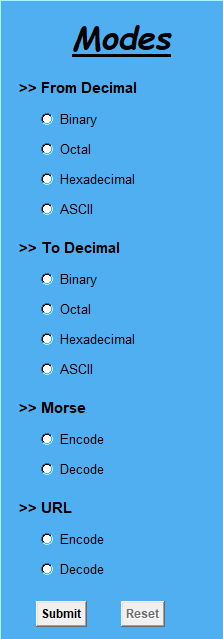
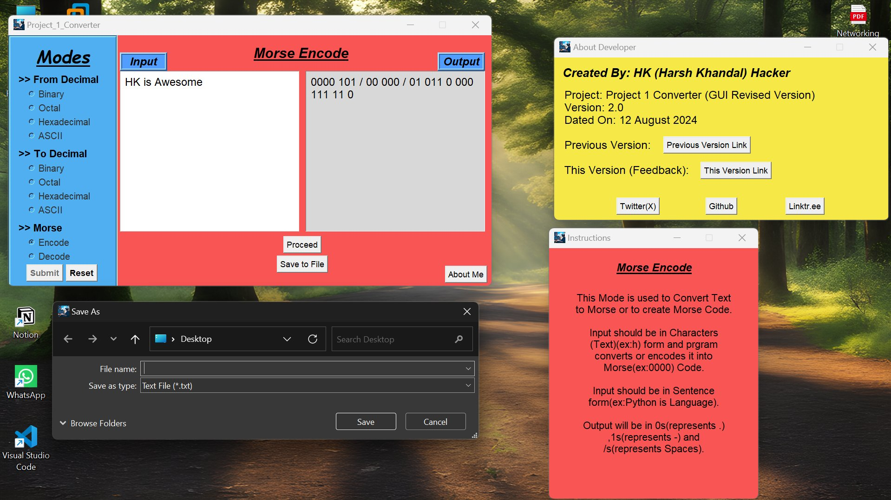
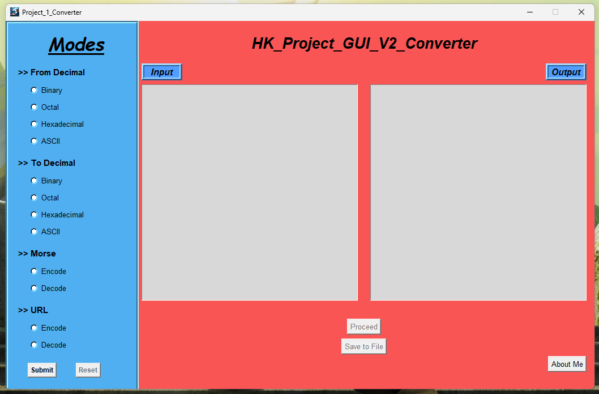
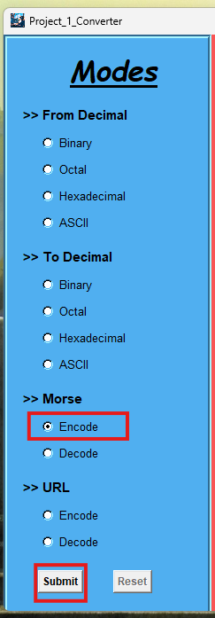
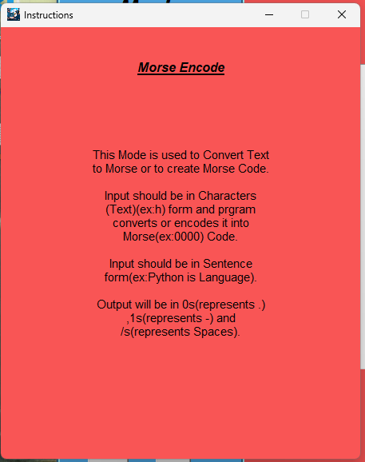
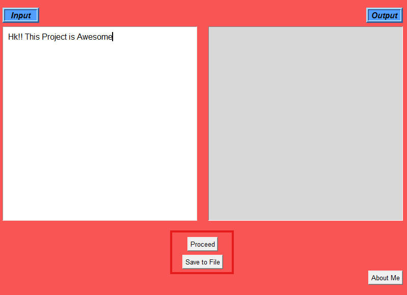
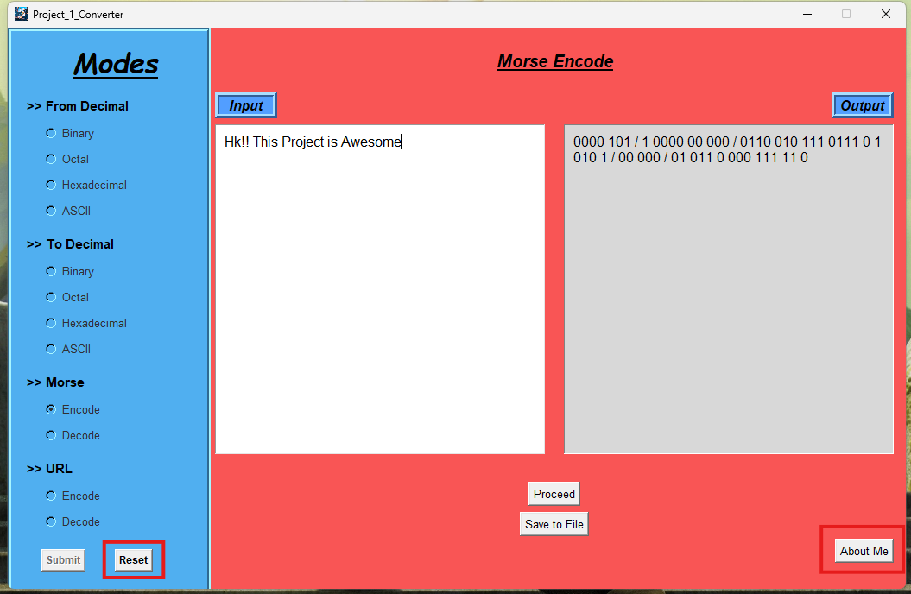

## Banner :
<pre>
 .d8888b.                                              888                           888     888  .d8888b.  
d88P  Y88b                                             888                           888     888 d88P  Y88b 
888    888                                             888                           888     888        888 
888         .d88b.  88888b.  888  888  .d88b.  888d888 888888  .d88b.  888d888       Y88b   d88P      .d88P 
888        d88""88b 888 "88b 888  888 d8P  Y8b 888P"   888    d8P  Y8b 888P"          Y88b d88P   .od888P"  
888    888 888  888 888  888 Y88  88P 88888888 888     888    88888888 888             Y88o88P   d88P"      
Y88b  d88P Y88..88P 888  888  Y8bd8P  Y8b.     888     Y88b.  Y8b.     888              Y888P    888"       
 "Y8888P"   "Y88P"  888  888   Y88P    "Y8888  888      "Y888  "Y8888  888               Y8P     888888888
</pre>                                                                                                               
                                                                                                                                                                                                                                  
# Project_1_GUI_Converter_v2
Converter_v2 is the 2nd Version or revised version of [Project_1_Converter](https://github.com/Hk-Hacker-Harsh/Converter).

## Description:
This Coverter_v2 is the updated version with GUI Ability, this program it written in Python3 Language and the main aim of this Program is to convert One Computer Number System to Other or to Encode or Decode URL or Morse.

## New Features:
  * GUI (Graphical User Interface) Enabled.
  * Decimal to HexaDecimal Bug/error Fixed.
  * Morse Encode and Decode Fixed and Improved.
  * URL Encode and Decode Added.

## About
* Created By HK (Harsh Khandal) Hacker
* Dated on 18/06/2025
* Language Python3
* Link: https://github.com/Hk-Hacker-Harsh/Converter_v2

* Previous Version Link: https://github.com/Hk-Hacker-Harsh/Converter
 
## Installation
* Clone Github Repo
* Install Python3
* Check if all Libraries installed or not. If not use requirements.txt file.
Run : ```pip install -r requirements.txt```
* Run the .py file.

## Requirements
Python3
Libraries:
 * pip install tkinter
 * pip install datetime
 * pip install webbrowser
 * pip install urllib

## Modes:
* Decimal to Binary : 123 --> 1111011
* Decimal to Octal  : 123 --> 173
* Decimal to HexaDecimal  : 123 --> 7B
* Decimal to ASCII  : 67 97 99 --> A a c
* Binary to Decimal : 1111011 --> 123
* Octal to Decimal  : 173 --> 123
* HexaDecimal to Decimal  : 7B --> 123
* ASCII to Decimal  : A a c --> 67 97 99
* Morse Encode  : Awesome --> 01 011 0 000 111 11 0 
* Morse Decode  : 01 011 0 000 111 11 0 --> awesome
* URL Encode  : https://github.com/project=converterv2 --> https%3A%2F%2Fgithub.com%2Fproject%3Dconverterv2%0A
* URL Decode  : https%3A%2F%2Fgithub.com%2Fproject%3Dconverterv2%0A --> https://github.com/project=converterv2

## Contact:
* [Twitter](https://x.com/Hk__Hacker)
* [Github](https://github.com/Hk-Hacker-Harsh)

The program uses following Libraries:
    - Tkinter : For Graphical View
    - Datetime : For Current Date (Used when saving Output to a File)
    - Webbrowser : To open external Links in browser (About me section)
    - urllib.parse : To Encode and Decode urllib

## Images:




## How to Use:
1. Install All the Required Libraries and Start the Program.


2. Select Mode you want to use from the list of Modes button and Click on Sumit.


3. Read the Instractions in the newly open window. 


4. Enter Data in Input box, and click on "Proceed" to get Output in the Output Box, or click "Save to file" to get Output in a Text File.


5. And Done!! If you want to know more about me then click on "About Me" option in Lower Right Side, Or you cn click Reset to use Other Mode. 



### Demo Video (Download): [Demo Video Download](/Demo/Demo.mp4)
### Demo Video (Youtube): [Demo Video YT](https://youtu.be/9-eerVu4f0M)

## 🤝 Contributing

Wanna improve it or fix a bug?

1. Fork the repo
2. Create a new branch (`git checkout -b feature-name`)
3. Commit your changes
4. Open a pull request ✅

I'm always open to fresh ideas!

### License : Free and Open source (FOSS) for all and everyone. MIT icense.